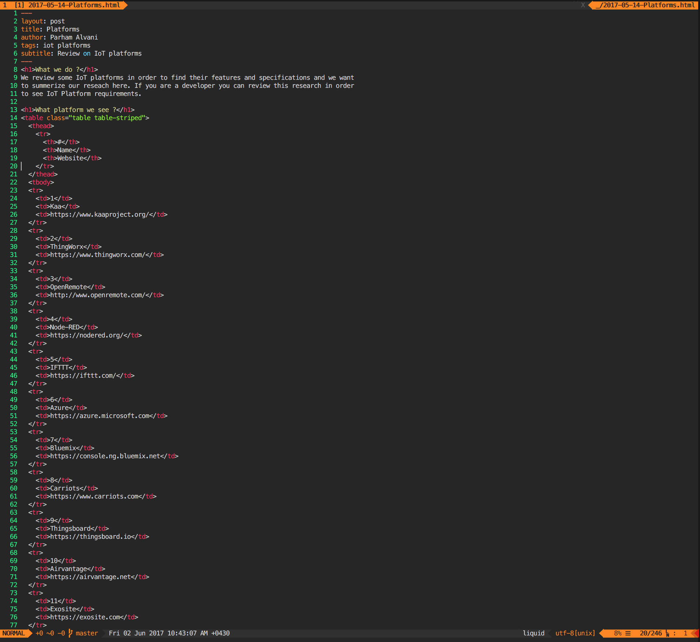
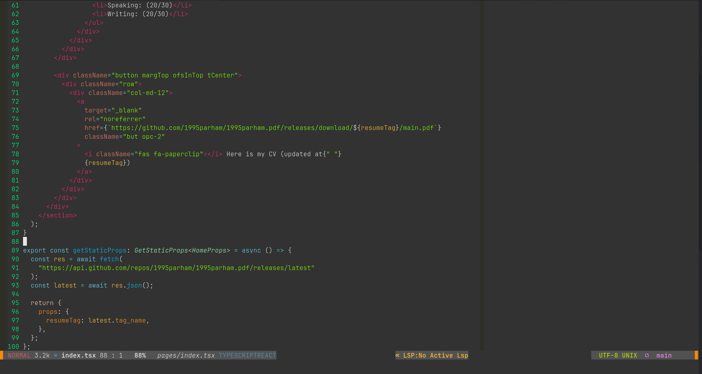
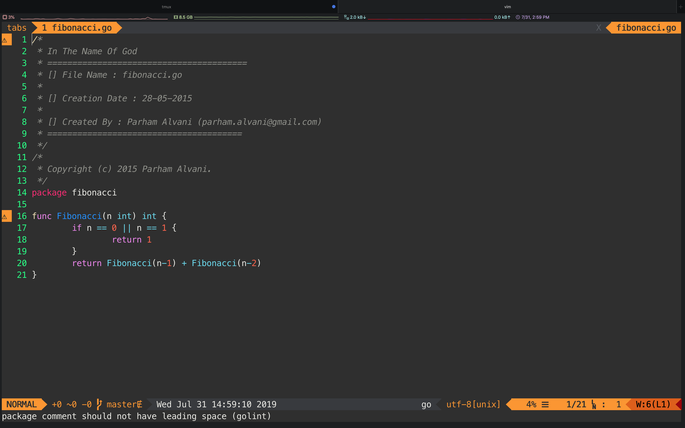

# Naz Neovim Theme


## Introduction

Naz theme is based on the tomorrow night theme but more cute.
It uses lua and [colorbuddy](https://github.com/tjdevries/colorbuddy.nvim) so it works with noevim 0.7.0+.
Naz theme has binding for following plugins:

- [nvim-treesitter](https://github.com/nvim-treesitter/nvim-treesitter)
- [nvim-tree.lua](https://github.com/kyazdani42/nvim-tree.lua)

## Install

```lua
plugin({
  '1995parham/naz.vim',
  branch = 'main',
  config = function()
    require('naz')
  end,
})
```

## Screenshots

### HTML



### NodeJS



### Python


### Go


